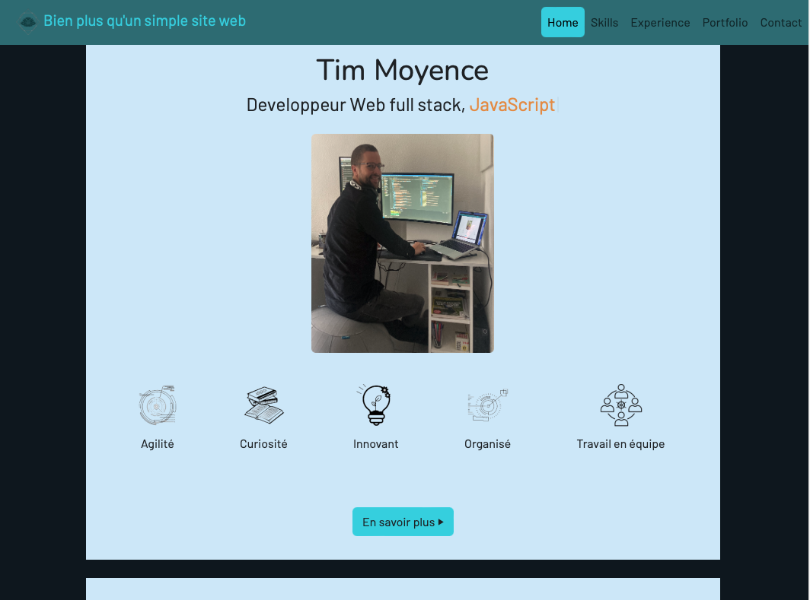

# Portfolio de développeur junior full stack

Ce projet est mon portfolio personnel en tant que développeur junior full stack en JavaScript, avec une spécialisation back end. Il présente mes compétences, mes réalisations et mes coordonnées.

## Technologies utilisées

- HTML5, CSS3, JavaScript, Bootstrap pour le front end
- Node.js, Express, postgreSQL pour le back end
- Git, GitHub, Railway pour le déploiement

## Fonctionnalités

- Une page d'accueil avec une introduction, une photo et un menu de navigation
- Une section "Compétences" avec des icônes et des barres de progression
- Une section "Réalisations" avec des images, des liens et des descriptions de mes projets
- Une section "Contact" avec un formulaire et des liens vers mes réseaux sociaux
- Un design responsive et adapté aux différents écrans (en cours de développement)

## Installation

Pour installer ce projet en local, vous devez avoir Node.js et MongoDB installés sur votre machine.

- Clonez ce dépôt ou téléchargez-le en zip
- Ouvrez un terminal et allez dans le dossier du projet
- Tapez `npm install` pour installer les dépendances
- Tapez `nodemon index.js` pour lancer le serveur
- Ouvrez votre navigateur et allez à l'adresse `http://localhost:3000`

## Démo

Vous pouvez voir une démo de ce projet à l'adresse suivante : https://pojet-portfolio-production.up.railway.app

## Licence

Ce projet est sous licence MIT. Vous pouvez le copier, le modifier et le redistribuer librement, à condition de mentionner la source originale.

